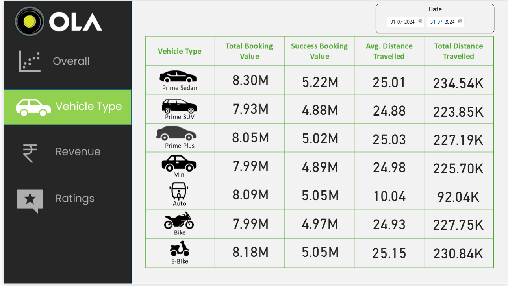

<div align="center">
  <h1 align="center">🚕 OLA-Ride-Hailing Performance Analysis 🚕</h1>
  <p align="center">
    An end-to-end analysis of 100,000 booking records, from data cleaning (Python) and analysis (SQL) to a final performance dashboard (Power BI).
  </p>
</div>

<p align="center">
  
  
  
  
  
</p>

---

## 📌 Table of Contents
- <a href="#overview">Overview</a>
- <a href="#business-problem">Business Problem</a>
- <a href="#dataset">Dataset</a>
- <a href="#tools--technologies">Tools & Technologies</a>
- <a href="#project-structure">Project Structure</a>
- <a href="#project-workflow--data-pipeline">Project Workflow & Data Pipeline</a>
- <a href="#key-performance-indicators-kpis">Key Performance Indicators (KPIs)</a>
- <a href="#research-questions--key-findings">Research Questions & Key Findings</a>
- <a href="#key-visualizations-dashboard">Key Visualizations (Dashboard)</a>
- <a href="#how-to-run-this-project">How to Run This Project</a>
- <a href="#final-recommendations">Final Recommendations</a>
- <a href="#author--contact">Author & Contact</a>

---
## 🧠 Project Overview
This project is an end-to-end **Ride-Hailing Performance Analysis** built on a dataset of **100,000 booking records**.
It uncovers **what drives operational success, customer value, and revenue generation** through data cleaning, SQL analytics, and Power BI visualization.

The analysis follows a complete **Data → Insight → Action** pipeline:
1. **Data Preparation (Python)**: Cleaning and transforming the raw 100k-row Excel file.
2. **Data Modeling & Analysis (SQL)**: Designing a database schema and running 13 analytical queries.
3. **Visualization & Insight Generation (Power BI)**: Building a 4-quadrant dashboard to tell the business story.
4. **Report & Documentation (Word & GitHub)**: Creating a BRD, Project Report, and a professional README.

---
## 🎯 Objectives
- Understand **booking success and failure rates** to identify operational problems.
- Identify **true high-value customers** based on revenue, not just ride count.
- Analyze **revenue streams** by vehicle type to find the most profitable segments.
- Pinpoint **demand hotspots** and **high-cancellation zones** to optimize driver allocation.

---

## 📊 Power BI Dashboard Overview
A **4-quadrant interactive dashboard** was created to provide a 360-degree view of the business.


## 5. Dashboard & Key Insights

### 🧩 Insight 1: Operational Health (Booking Status)

A major finding was that **17.89%** of all bookings are **"Canceled by Driver"**, representing a significant **revenue leak** and **poor customer experience**.


### 💰 Insight 2: Revenue Drivers (Vehicle Type)

**'Prime Sedan'** is the most profitable category, generating **8.8M** in revenue, followed by **'Prime SUV' (5.5M)**.





### 💎 Insight 3: True Customer Value

By switching the metric from **"Booking Count"** to **"Total Spending"** (on 'Success' rides only), we identified our *true* high-value customers.


### 📍 Insight 4: Demand Hotspots

**'Whitefield'**, **'Marathahalli'**, and **'Electronic City'** are the top 3 pickup locations, indicating where **driver allocation** should be prioritized.


---
## 💡 Key Insights & Recommendations

This analysis uncovered three critical insights that form the basis of our strategic recommendations:

| Insight | Finding | Recommendation |
| :--- | :--- | :--- |
| **1. The Driver Cancellation Leak** | The single biggest problem is **17.89%** of all rides being **'Canceled by Driver'**. This is a massive revenue leak and source of customer dissatisfaction. | **Investigate High-Cancellation Zones:** Use SQL Query #12 to find *where* this happens most and survey drivers in those areas to find the root cause (traffic, payment, etc.). |
| **2. The Flawed Customer Metric** | The old metric (Booking Count) was wrong. Our analysis (on 'Success' rides only) shows the Top Customer (`CID995321`) spent **77.3K**. | **Launch a VIP Program:** Stop rewarding "noisy" (high-cancellation) customers. Focus retention efforts and loyalty perks on the *true* Top Spenders. |
| **3. The Revenue Engine** | **'Prime Sedan'** is the company's financial engine, generating **8.8M** in revenue, far more than any other category. | **Protect the 'Prime Sedan' Fleet:** Ensure this fleet has the best driver support, lowest wait times, and highest priority for maintenance and incentives. |

---


## ⚙️ SQL Analysis Highlights (13 Business Questions Answered)

1.  What is the **Overall Booking Success Rate**?
2.  What is the **Daily Revenue Trend** from successful rides?
3.  What are the **Top Reasons for Failed Bookings** (Driver Cancel, No Driver, etc.)?
4.  Who are the **Top 10 Most Valuable Customers** (by Total Spend)?
5.  What is the **Average Driver Rating by Vehicle Type**?
6.  What are the **Top 10 Most Popular Pickup Locations**?
7.  What are the **Top 10 Most Popular Routes** (A to B)?
8.  What is the **Impact of Wait Time (V_TAT)** on Driver Ratings?
9.  What is the **Payment Method Distribution** (Cash vs. UPI)?
10. What are the **Busiest Hours of the Day**?
11. What is the **Average Ride Distance & Value** by Vehicle Type?
12. What are the **Top Locations with High Driver Cancellation**?
13. What are the characteristics of **Incomplete Rides**?

---
## ⚙️ Python Data Preparation Highlights

1.  **Loaded Dataset:** Imported `Bookings-100000-Rows.xlsx` into a Pandas DataFrame.
2.  **Dropped Unusable Columns:** Removed `Incomplete_Rides_Reason`, `Canceled_Rides_by_Customer`, and `Canceled_Rides_by_Driver` (due to >90% missing data).
3.  **Imputed Missing Data (Numerical):** Filled `null` values in `Driver_Ratings`, `V_TAT`, and `C_TAT` using the **median** to avoid skew from outliers.
4.  **Imputed Missing Data (Categorical):** Filled `null` values in `Payment_Method` using the **mode** (most frequent value).
5.  **Standardized Formats:** Converted `Date` and `Time` columns to the correct datetime objects.
6.  **Handled Missing Data (Default):** Filled `null` values in `Incomplete_Rides` with 'No' based on business logic.
7.  **Saved Cleaned File:** Exported the fully prepped DataFrame to `cleaned_bookings.csv` for use in Power BI and SQL analysis.

---

## 🚀 How to Use

1. Clone the repository:

   ```bash
   git clone [https://github.com/](https://github.com/)[YOUR_USERNAME]/Ride-Hailing-Analysis-Dashboard.git
